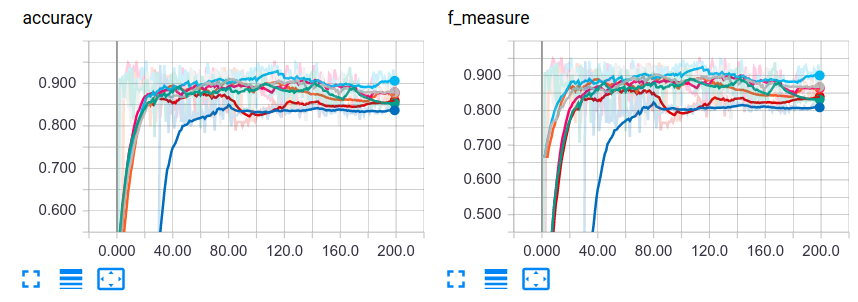
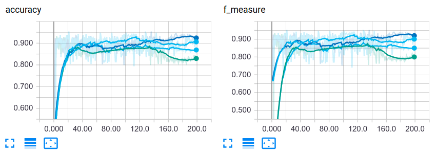
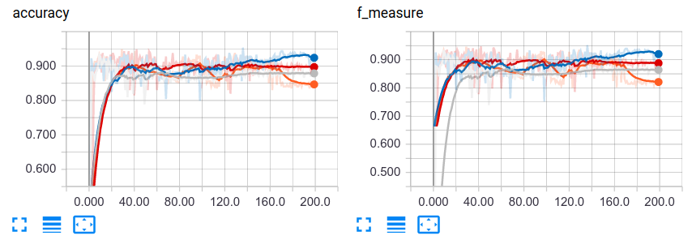
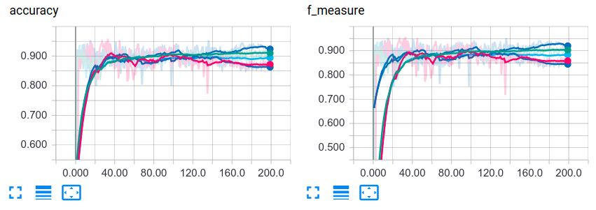
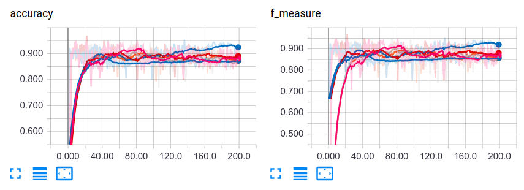
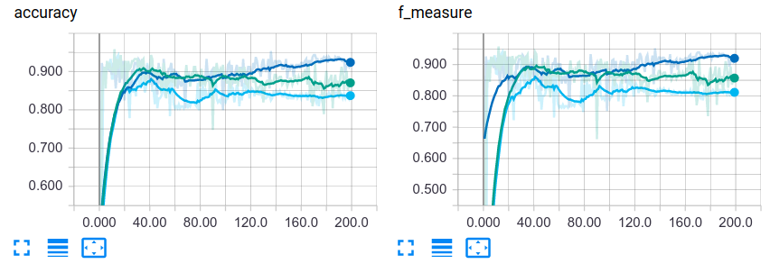

# text-classification-with-CNN-LSTM

## Task

Given some texts selected from two novels from different authors, train a machine to classify them.

## Prerequisites

* Python 3.5+
* Tensorflow 1.3+
* Keras 2.0.0+

## Architecture

The whole network can be separated into three main part.

### 1. Embedding

I offer two methods to embed sequence, namely, [char-level embedding](https://arxiv.org/abs/1508.06615) and [word-level embedding](http://papers.nips.cc/paper/5021-distributed-representations-of-words-and-phrases-and-their-compositionality.pdf). You need to choose at least one of them.

Word-level embedding is implemented with 'lookup' function in tensorflow. Char-level embedding is implemented with a standard CNN net.

After normal embedding, a [highway](https://arxiv.org/pdf/1505.00387.pdf) net is added to make the embedding more expressible.

### 2. LSTM/CNN

After embedding, I add a layer to extract the syntactic/semantic style of the text. I provide with three ways to do this.

* Multi-layer bidirectional [LSTM net](http://www.mitpressjournals.org/doi/abs/10.1162/neco.1997.9.8.1735)
* [CNN + Max-pooling](https://www.researchgate.net/profile/Yann_Lecun/publication/2453996_Convolutional_Networks_for_Images_Speech_and_Time-Series/links/0deec519dfa2325502000000.pdf)
* The original embedding

You need to choose at least one of them (Two or all of them are as well OK).

### 3. MLP

Finally, I add a multi-layer perceptrons (also known as the fully-connected network) to make a final decision. It's quite straightforward.

## Dataset

There are a training and a test dataset. The training dataset contains 6 thousand sentences, with an ill portion of 1:5. Test dataset contains 6 hundred sentences with a portion of 1:1.

The training set is split by me into two parts, the true training set and validation set, with a percentage of 10%.

Because of the severe unbalance of the training set, for each training epoch, I randomly sample the same number of positive and negative sentences from the training set.

## Metrics

I save these things into the log file.

* accuracy
* loss
* precision
* recall
* f-measure (also known as f1 score)
* mean-pred (the mean output of the last mlp layer)
* pred-pos-ratio (the portion of positive prediction)

With the help of tensorboard, these things can be beautifully displayed on a chart.

## Hyper-parameters searching

With the greedy algorithm, I searched some architecture and parameters. What I found are listed following.

* Best embedding: word-level embedding only
* Best middle layer: LSTM
* The word-embedding dimension: 30 (among 20, 26, 40, 50, 60, 70, 80, 100)
* The number of highway network layers: 3
* The number of words: 11k ( 12.5k totally) (among 10k, 11k, 12k, 13k)
* The number of hidden LSTM-layer: 3
* The sequence length: 60
* The dimension of LSTM output: 50

Search for a proper word-embedding dimension (accuracy and f-measure only):

Search for a proper number of words (accuracy and f-measure only):

Search for a proper max seq length (accuracy and f-measure only):

Search for a proper depth of highway net (accuracy and f-measure only):

Search for a proper depth of LSTM net (accuracy and f-measure only):

Search for a proper dimension of LSTM net (accuracy and f-measure only):

It's absolutely not the best hyper-parameters. Due to my limited time, I didn't try to search for higher accuracy.

Here are my results in the test set:

|accuracy | precision| recall|f_measure|
|-------|-----------|--------|---------|
|0.9317|0.9191|0.9467|0.9327|

## Future work

* More fine-grained tuning could be done.
* Some tricks, like dropout, can be added to it.

Welcome for pull requests!

